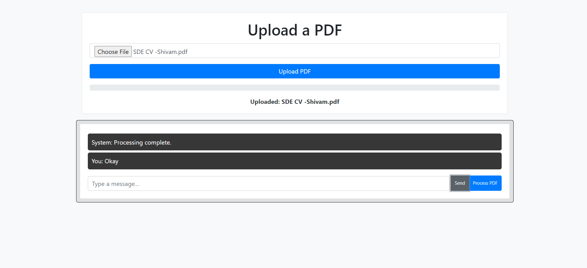

# PDF Reader

PDF Reader is a simple web application that allows users to upload and read PDF files. It provides a user-friendly interface for viewing PDF documents.

## Features

- Upload PDF files for reading.
- Display PDF files in a user-friendly viewer.
- Zoom in and out of PDF documents.
- Navigate through pages using controls.
- Download the uploaded PDF file.
- Attractive and responsive user interface.

## Getting Started

These instructions will help you get a copy of the project up and running on your local machine.

### Prerequisites

- Web browser (Google Chrome, Mozilla Firefox, etc.)
